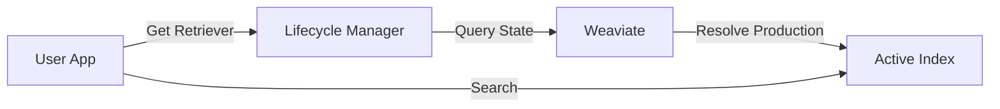

# Weaviate RAG Lifecycle Manager

A reference architecture and Python client for managing the lifecycle of Retrieval-Augmented Generation (RAG) systems using Weaviate as the system of record.


## 🚀 Problem Statement

As RAG systems move to production, teams face critical lifecycle challenges:
*   **Embedding Model Upgrades**: How do you switch from `text-embedding-3-small` to `large` without downtime?
*   **Dataset Versioning**: Which version of the "Company Wiki" is currently indexed?
*   **Governance**: How do you safely rollback a bad index?

This project solves these problems by treating **Weaviate as the system of record** for lifecycle state, compatible with LangChain and other frameworks.

## 🏗️ Architecture



## ✨ Key Features

*   **Explicit Lifecycle States**: Manage indices through `DRAFT` → `STAGING` → `PRODUCTION` → `DEPRECATED`.
*   **Zero-Downtime Upgrades**: Promote new indices instantaneously while keeping the old ones for rollback.
*   **Smart Retrieval**: A `LifecycleAwareRetriever` that dynamically routes queries to the active production index.
*   **Standardized Schema**: Tracks `RAGDataset`, `EmbeddingConfig`, and `IndexGeneration` metadata directly in Weaviate.

## 📦 Installation

```bash
pip install -r requirements.txt
```

## 🛠️ Usage

### 1. Initialize the Manager

```python
import weaviate
from weaviate_rag_lifecycle import WeaviateRAGLifecycleManager

client = weaviate.connect_to_local() # or connect_to_wcs(...)
manager = WeaviateRAGLifecycleManager(client)
manager.initialize() # Sets up the metadata schema
```

### 2. Create and Promote an Index

```python
from weaviate_rag_lifecycle import LifecycleState

# Define your data source and embedding strategy
dataset = manager.create_dataset(name="WikiDocs", version="v1.0")
config = manager.register_embedding_config(model_name="openai/text-embedding-3-small", chunk_size=512, chunk_overlap=50)

# Create a container for the index (Status: DRAFT)
gen = manager.create_index_generation(dataset.id, config.id)

# ... [Ingest your data into gen.weaviate_collection_name] ...

# Promote to Production
manager.promote_index(gen.id, LifecycleState.PRODUCTION)
```

### 3. Query with LangChain

The `LifecycleAwareRetriever` automatically finds the correct index for you.

```python
from weaviate_rag_lifecycle import LifecycleAwareRetriever

retriever = LifecycleAwareRetriever(
    lifecycle_manager=manager,
    dataset_name="WikiDocs",
    search_type="near_text" # or "bm25"
)

docs = retriever.invoke("What is the capital of France?")
```

## 📖 Documentation

*   [**Design Document (RFC)**](docs/design_document.md): Detailed explanation of the architecture, schema design, and motivation.

## ⚡ Demo

Run the included verification script to see the full lifecycle in action (uses Weaviate Embedded):

```bash
python demo_lifecycle.py
```

## 🤝 Contributing

Contributions are welcome! Please see the [Design Document](docs/design_document.md) for the architectural vision.
